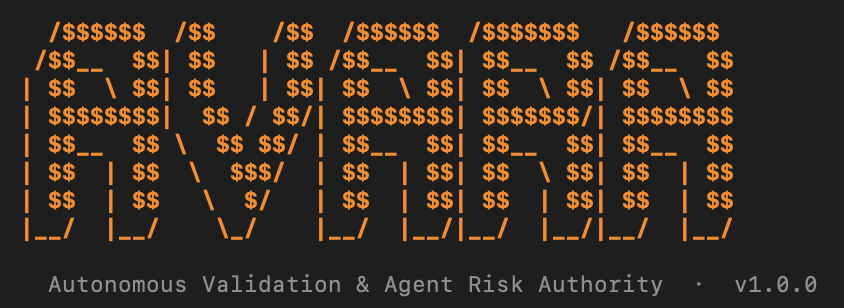
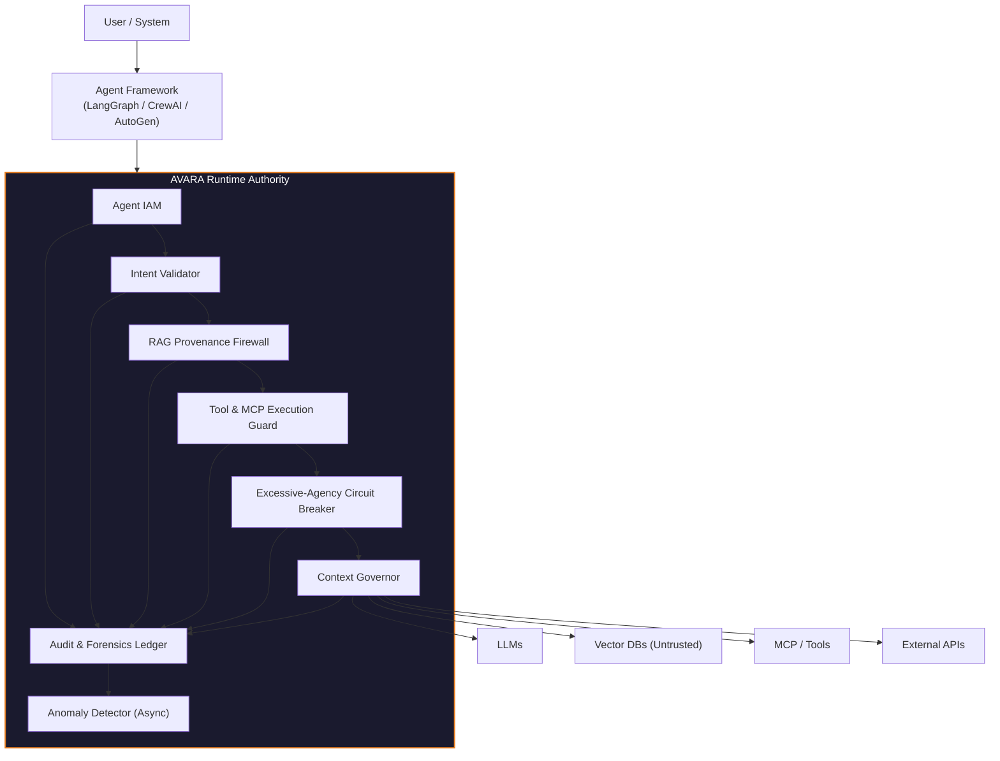
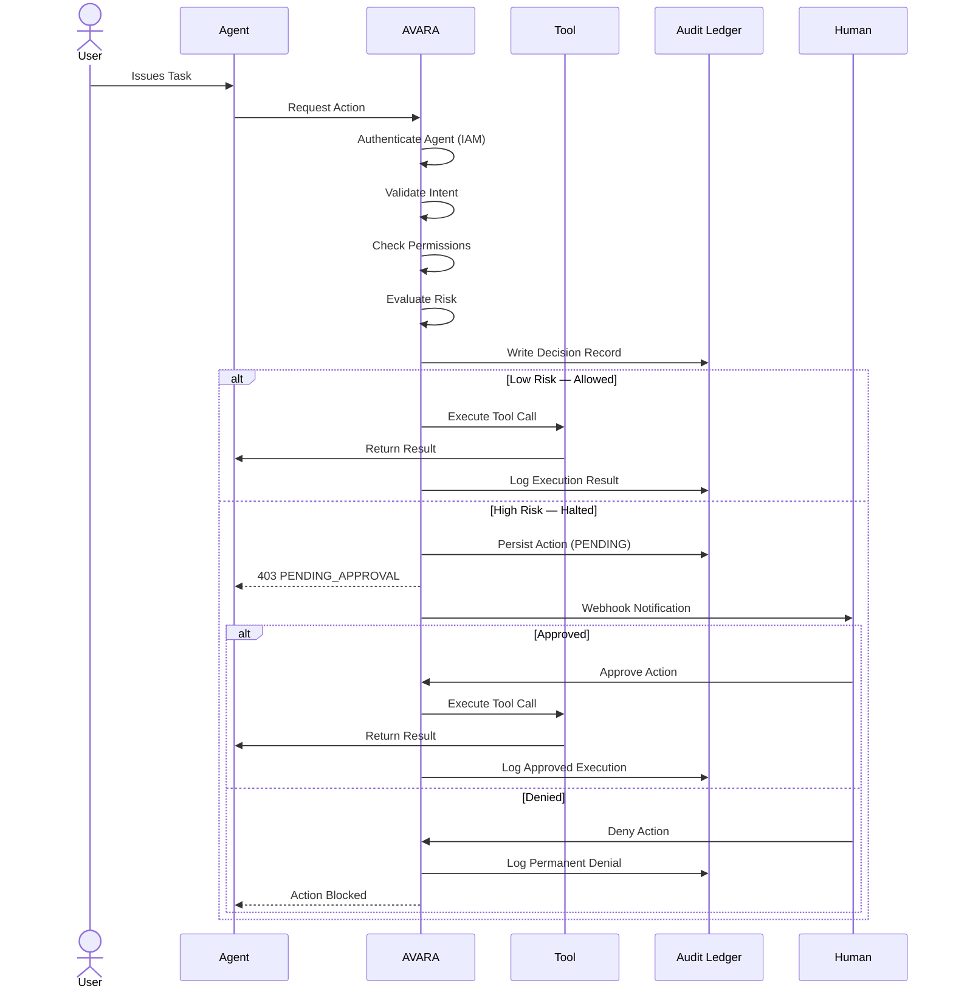
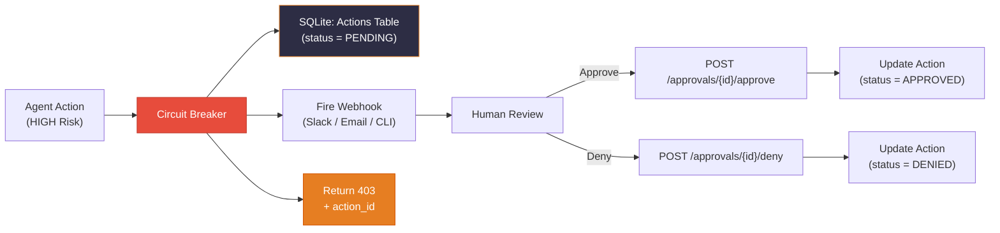

# AVARA - Autonomous Validation & Agent Risk Authority

> **AVARA is a runtime security and governance system for autonomous AI agents.**
> It enforces intent, permissions, provenance, and safety **at execution time**, not at training time.

---

## Why AVARA Exists

AI agents crossed a boundary in 2024–2026: from assistive to **autonomous**, from human-paced to **machine-speed**, from single-model to **multi-agent + tool ecosystems**.

Security did not evolve with this shift. Existing controls (WAF, IAM, RBAC, DLP) assume human decision points, static APIs, and deterministic software. AI agents violate all three.

AVARA introduces a new control layer — an **always-on runtime authority** that sits between agents and the world.

---

## Quick Start

### 1. Run with Docker (recommended)

```bash
docker compose up -d avara-api
docker compose logs -f avara-api
```

### 2. Run Locally

```bash
python3 -m venv venv
source venv/bin/activate
pip install -r requirements.txt
uvicorn src.api.server:app --host 0.0.0.0 --port 8000
```

### 3. Quick Test

Test your running server instantly by taking the interactive CLI tour.
```bash
./avara_cli.py demo
```

---

## AVARA CLI

The CLI is the primary management interface for security engineers. It supports both **direct commands** and a fully **interactive REPL mode**.

### Customize Theme
You can explicitly set the CLI color palette to `orange`, `blue`, `purple`, `green`, or `red`.
```bash
./avara_cli.py theme blue
```

### Direct Commands

```bash
./avara_cli.py demo                                  # Run guided tour of all guards
./avara_cli.py status                                # Check server health
./avara_cli.py provision prod_agent "Marketing Bot"  # Create an identity
./avara_cli.py pending                               # List halted actions
./avara_cli.py approve <action_id>                   # Approve halted action
./avara_cli.py deny <action_id>                      # Deny halted action
./avara_cli.py revoke <agent_id>                     # Kill a rogue agent
./avara_cli.py logs                                  # View streaming audit log
```

### Interactive Mode

```bash
./avara_cli.py
# Launches the AVARA shell — type commands interactively
```

```
avara> theme green
avara> status
  ✔  AVARA Authority is ONLINE

avara> provision prod_agent "My Bot" --scopes execute:read_file
  ✔  Identity provisioned
  Agent ID : agt_d67298cf

avara> logs
  [2026-02-27 20:00:01] IAM_PROVISION  agt_d67298cf  ...

avara> exit
```

---

## System Architecture



---

## Secure Agent Execution Flow



---

## Circuit Breaker Webhook Flow



---

## Core Components

| Component | What It Does |
|---|---|
| **Intent Validator** | Compares user intent vs agent action. Detects semantic drift and blocks instruction hijacking. |
| **RAG Provenance Firewall** | Enforces document identity & ACLs. Prevents permission bypass via retrieval. Scans for latent instructions. |
| **Tool & MCP Execution Guard** | Registers tools explicitly. Validates metadata and enforces per-tool permissions. |
| **Circuit Breaker** | Detects destructive actions. Requires human approval via async webhooks. Prevents zero-click attacks. |
| **Agent IAM** | Ephemeral identity, role, permission scope, and token TTL per agent. No anonymous execution. |
| **Multi-Agent Monitor** | Logs agent-to-agent messages. Tracks assumption propagation and detects unsafe recomposition. |
| **Context Governor** | Enforces token budgets. Preserves critical constraints. Prevents context saturation & rot. |
| **Audit Ledger** | Full execution trace. Replayable timelines. Compliance-ready evidence. |
| **Anomaly Detector** | Behavioral heuristics for rate-limit bursts and repetitive suspicious patterns. Auto-revokes compromised agents. |

---

## Project Structure

```
AVARA/
├── src/
│   ├── api/
│   │   ├── server.py              # FastAPI REST endpoints
│   │   └── framework_adapter.py   # Generic agent framework adapter
│   ├── core/
│   │   ├── iam_service.py         # Agent Identity & Access Management
│   │   └── audit_ledger.py        # Immutable audit logging
│   ├── guards/
│   │   ├── tool_guard.py          # Tool registration & permission enforcement
│   │   ├── circuit_breaker.py     # Excessive-agency halt & approval
│   │   ├── intent_validator.py    # Semantic drift detection
│   │   ├── rag_firewall.py        # RAG provenance & instruction scanning
│   │   ├── multi_agent_monitor.py # Cross-agent safety monitoring
│   │   ├── context_governor.py    # Token budget & safety anchoring
│   │   └── anomaly_detector.py    # Behavioral anomaly detection
│   ├── db/
│   │   └── persistent_store.py    # SQLite persistence layer
│   └── integrations/
│       └── langchain_adapter.py   # LangChain callback handler
├── avara_cli.py                   # Interactive CLI management tool
├── Dockerfile                     # Container image
├── docker-compose.yml             # Docker Compose config
└── requirements.txt               # Python dependencies
```

---

## API Endpoints

| Method | Endpoint | Description |
|---|---|---|
| `POST` | `/iam/provision` | Provision ephemeral agent identity |
| `DELETE` | `/iam/revoke/{agent_id}` | Revoke an agent identity |
| `POST` | `/guard/validate_action` | Main interceptor — validates intent, permissions, risk |
| `POST` | `/guard/prepare_context` | Context governor — enforces token budget |
| `POST` | `/guard/approvals/{id}/approve` | Webhook callback — approve halted action |
| `POST` | `/guard/approvals/{id}/deny` | Webhook callback — deny halted action |
| `GET` | `/guard/approvals/{id}/status` | Poll approval status |
| `GET` | `/health` | Server health check |

---

## Framework Integration (LangChain)

Wrap any LangChain agent with AVARA protection in 3 lines:

```python
from src.integrations.langchain_adapter import AVARALangChainCallback

avara_guard = AVARALangChainCallback(
    agent_id="agt_abc123",
    task_intent="Summarize financial documents"
)

agent = initialize_agent(
    tools, llm, agent="zero-shot-react-description",
    callbacks=[avara_guard]  # AVARA intercepts all tool calls
)
```

---

## Design Philosophy

1. **Runtime > Training** — Security is enforced at execution time, not training time
2. **Agents Are Actors** — Every agent has identity, permissions, and accountability
3. **Assume Compromise** — Documents, tools, agents, and outputs may all be hostile
4. **Explicit Over Implicit** — Registration, permissions, approvals, and audit trails are all explicit
5. **No Silent Side Effects** — Every mutation is observable, logged, and gateable

---

## Threat Model

AVARA defends against:

- Indirect prompt injection
- Excessive agent autonomy
- RAG-based permission bypass
- MCP / tool supply-chain attacks
- Autonomous data exfiltration
- Zero-click exploitation
- Multi-agent unsafe recomposition
- Context manipulation & rot
- Non-human identity abuse

---

## Validation Criteria

AVARA is correctly implemented when:

- No agent can act anonymously
- No destructive action occurs without approval
- No tool executes without registration
- No RAG document bypasses ACLs
- Every incident is replayable
- Every decision is attributable

---

> **AVARA does not make agents smarter. AVARA makes agents accountable.**
