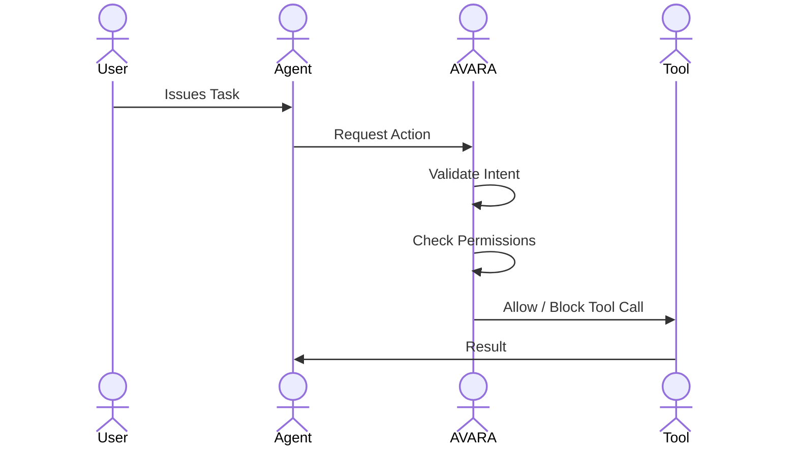
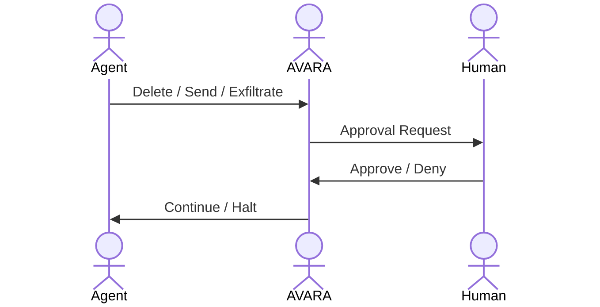
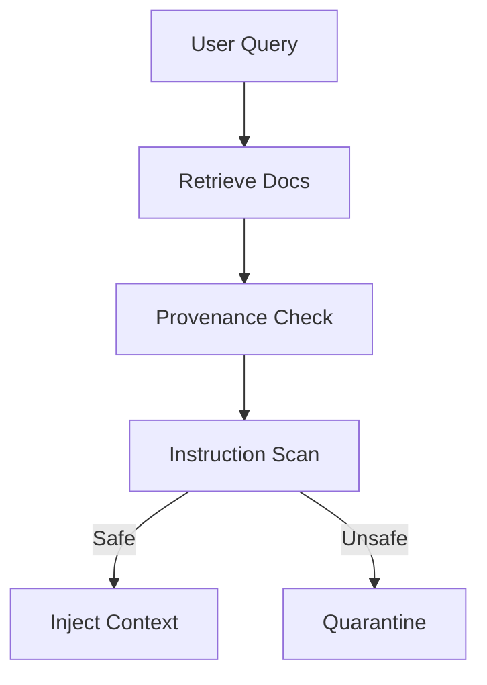
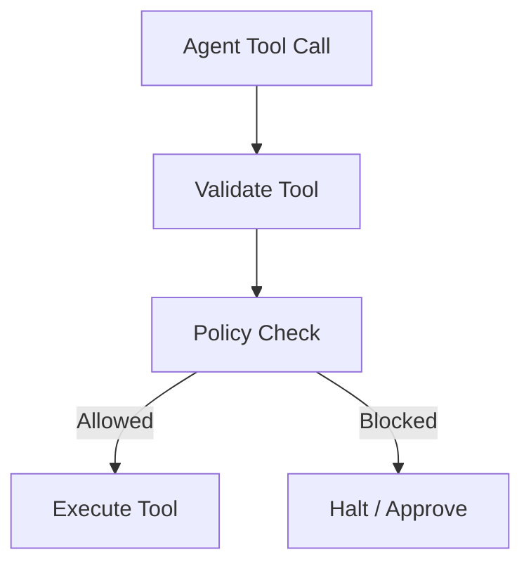

# **AVARA**

  

## **Autonomous Validation & Agent Risk Authority**

  

> **AVARA is a runtime security and governance system for autonomous AI agents.**

> It enforces intent, permissions, provenance, and safety **at execution time**, not at training time.

---

## **1. Inspiration & Motivation**

  

### **Why AVARA exists**

  

AI agents crossed a boundary in 2024–2026:

- From _assistive_ → **autonomous**
    
- From _human-paced_ → **machine-speed**
    
- From _single-model_ → **multi-agent + tool ecosystems**
    

  

Security **did not evolve with this shift**.

  

Existing controls (WAF, IAM, RBAC, DLP, EDR):

- assume **human decision points**
    
- assume **static APIs**
    
- assume **deterministic software**
    

  

AI agents violate all three.

  

AVARA is inspired by the realization that **agent security is not a model problem** —

it is a **runtime authority problem**, similar to how:

- Kubernetes needed a **control plane**
    
- Cloud needed **IAM**
    
- Browsers needed **sandboxing**
    

---

## **2. Problems We Are Facing (Reality, Not Theory)**

  

### **Problem 1 — Security controls sit in the wrong layer**

- Guardrails are applied at prompt time
    
- Attacks occur at **retrieval, tool invocation, and orchestration time**
    
- There is no “checkpoint” once an agent starts acting
    

---

### **Problem 2 — Implicit trust everywhere**

  

Agents blindly trust:

- vector databases
    
- RAG outputs
    
- MCP tools
    
- tool metadata
    
- sibling agents
    

  

This creates **permission bypass by reasoning**, not by policy.

---

### **Problem 3 — Excessive agency by design**

  

Agents:

- delete files
    
- send emails
    
- rotate credentials
    
- call external APIs
    

  

…without confirmations, intent verification, or blast-radius limits.

---

### **Problem 4 — No visibility into agent behavior**

  

After an incident, organizations cannot answer:

- _Which document caused this?_
    
- _Which agent escalated privileges?_
    
- _Which tool chain executed the destructive action?_
    

  

No audit trail → no root cause → no trust.

---

### **Problem 5 — Multi-agent failures are invisible**

  

Each agent behaves “correctly” in isolation.

The system fails **emergently**.

  

Existing safety systems **cannot reason across agents**.

---

## **3. Problem Statement (Formal)**

  

> **There is no runtime authority that can observe, constrain, and govern autonomous AI agents as they reason, retrieve, and act across systems.**

  

As a result:

- indirect prompt injection is undetectable
    
- RAG becomes a privilege bypass
    
- MCP tools become a supply-chain attack vector
    
- hallucinations compound into decisions
    
- autonomous exfiltration occurs without alerts
    

---

## **4. AVARA’s Solution (Core Idea)**

  

### **AVARA introduces a new control layer:**

  

> **An always-on, runtime authority that sits between agents and the world.**

  

AVARA does **not**:

- retrain models
    
- replace agent frameworks
    
- rely on static filters
    

  

AVARA **does**:

- intercept execution
    
- enforce intent and permissions
    
- validate provenance
    
- gate destructive actions
    
- record everything
    

---

## **5. System Architecture**

  

### **High-Level Architecture**

```
User / System
     |
Agent Framework (LangGraph / CrewAI / AutoGen)
     |
┌──────────────────────────────────────────┐
│                AVARA                     │
│ ──────────────────────────────────────── │
│  • Intent Validator                      │
│  • RAG Provenance Firewall               │
│  • Tool & MCP Execution Guard            │
│  • Agent IAM (Non-Human Identity)        │
│  • Excessive-Agency Circuit Breaker      │
│  • Multi-Agent Safety Monitor            │
│  • Context Governor                      │
│  • Audit & Forensics Ledger              │
└──────────────────────────────────────────┘
     |
LLMs | Vector DBs | MCP Tools | SaaS APIs
```

AVARA is a **sidecar / gateway**, not a rewrite.

---

## **6. Core Components (What AVARA Actually Does)**

  

### **6.1 Intent Validation Engine**

- Compares **user intent** vs **agent action**
    
- Detects semantic drift
    
- Blocks instruction hijacking
    

---

### **6.2 RAG Provenance Firewall**

- Enforces document identity & ACLs
    
- Prevents permission bypass via retrieval
    
- Scans retrieved content for latent instructions
    

---

### **6.3 Tool & MCP Execution Guard**

- Registers tools explicitly
    
- Validates metadata
    
- Enforces per-tool permissions
    
- Blocks hidden prompt execution
    

---

### **6.4 Excessive-Agency Circuit Breaker**

- Detects destructive actions
    
- Requires human approval or policy override
    
- Prevents zero-click wipe/exfiltration attacks
    

---

### **6.5 Agent IAM (Non-Human Identity)**

- Each agent has:
    
    - identity
        
    - role
        
    - permission scope
        
    - token TTL
        
    
- No hardcoded credentials
    
- No implicit privilege chaining
    

---

### **6.6 Multi-Agent Safety Monitor**

- Logs agent-to-agent messages
    
- Tracks assumption propagation
    
- Detects unsafe recomposition of outputs
    

---

### **6.7 Context Governor**

- Enforces token budgets
    
- Preserves critical constraints
    
- Prevents context saturation & rot
    

---

### **6.8 Audit & Forensics Ledger**

- Full execution trace
    
- Replayable timelines
    
- Compliance-ready evidence
    

---

## **7. Use Case Diagrams (Mermaid)**

  

### **7.1 Secure Agent Execution**



---

### **7.2 Destructive Action Protection**



---

## **8. Key Workflows**

  

### **8.1 RAG Retrieval Workflow**



---

### **8.2 Tool Invocation Workflow**



---

## **9. Implementation Plan**

  

### **Phase 1 — 

- Tool execution guard
    
- RAG document scanning
    
- Audit logging
    
- Destructive-action approvals
    

  

**Target:** RAG copilots, email agents

---

### **Phase 2 

- Agent IAM
    
- MCP registry
    
- RAG ACL enforcement
    
- Behavioral anomaly detection
    

---

### **Phase 3

- Embedding poisoning research
    
- Multi-agent consensus
    
- Automated credential rotation
    
- Context governance standards
    

---

## **10. How AVARA Is Different From Existing Solutions**

|**Existing Tools**|**AVARA**|
|---|---|
|Prompt filters|Runtime execution authority|
|Model-centric|Agent-centric|
|Static rules|Context-aware decisions|
|Single-agent focus|Multi-agent safety|
|No provenance|Enforced document identity|
|Logs only|Replayable forensics|

AVARA treats **agents as autonomous actors**, not chatbots.

---

## **11. What AVARA Ultimately Becomes**

- The **control plane for agentic AI**
    
- The **IAM of autonomous systems**
    
- The **runtime authority that regulators will expect**
    
- The **only place where intent, action, and consequence meet**
    

---

### **Final One-Line Definition**

  

> **AVARA is a runtime authority that validates, governs, and secures autonomous AI agents as they reason and act across systems.**

---

Perfect.

What you’re asking for now is **the canonical build document** — the thing an engineer, reviewer, or future contributor can open and say:

  

> “This is the law of the system. We build AVARA _according to this_, not vibes.”

---

# **AVARA**

  

## **Autonomous Validation & Agent Risk Authority**

  

### **Technical Architecture & Build Rules (Authoritative Spec)**

---

## **0. Document Status & Scope**

- **Audience**: System architects, security engineers, agent-framework developers
    
- **Scope**: Runtime security & governance for autonomous AI agents
    
- **Non-goal**: Model training, model fine-tuning, AI alignment research
    

  

> **AVARA governs execution, not intelligence.**

---

## **1. Core Design Philosophy (Non-Negotiable)**

  

### **Rule 1 — Runtime > Training**

  

AVARA **must never rely on model training, prompt tuning, or fine-tuning** for security.

  

**Rationale**

- Training-time defenses are static
    
- Attacks are adaptive
    
- Runtime is the only enforceable control plane
    

---

### **Rule 2 — Agents Are Actors, Not APIs**

  

Every agent is treated as:

- an **autonomous actor**
    
- with **identity**
    
- with **permissions**
    
- with **accountability**
    

  

**No agent executes anonymously. Ever.**

---

### **Rule 3 — Assume Compromise**

  

AVARA must assume:

- documents may be poisoned
    
- tools may be malicious
    
- agents may hallucinate
    
- outputs may be wrong
    
- intent may drift
    

  

Security is based on **containment**, not trust.

---

### **Rule 4 — Explicit Over Implicit**

  

Anything implicit is a vulnerability.

- Explicit tool registration
    
- Explicit permissions
    
- Explicit approvals
    
- Explicit provenance
    
- Explicit audit trails
    

---

### **Rule 5 — No Silent Side Effects**

  

If an action:

- mutates state
    
- deletes data
    
- transmits data
    
- escalates privilege
    

  

…it **must be observable, logged, and gateable**.

---

## **2. Threat Model (What AVARA Defends Against)**

  

AVARA is designed to **counter or mitigate**:

1. Indirect prompt injection
    
2. Excessive agent autonomy
    
3. RAG-based permission bypass
    
4. MCP / tool supply-chain attacks
    
5. Autonomous data exfiltration
    
6. Zero-click exploitation
    
7. Multi-agent unsafe recomposition
    
8. Context manipulation & rot
    
9. Non-human identity abuse
    

  

**Explicitly out of scope (for now):**

- Training-time model poisoning
    
- Ground-truth factual correctness
    

---

## **3. System Positioning**

  

### **Where AVARA Sits**

```
Agent Framework
  (LangGraph / CrewAI / AutoGen)
        |
        v
┌──────────────────────────────┐
│            AVARA             │
│  Runtime Authority Layer     │
└──────────────────────────────┘
        |
        v
LLMs • Vector DBs • MCP Tools • APIs
```

AVARA is:

- not an agent
    
- not a model
    
- not a proxy
    

  

It is a **policy-enforcing execution authority**.

---

## **4. High-Level Architecture**

  

### **Core Subsystems (Mandatory)**

1. **Agent Identity & IAM**
    
2. **Intent Validation Engine**
    
3. **RAG Provenance Firewall**
    
4. **Tool & MCP Execution Guard**
    
5. **Excessive-Agency Circuit Breaker**
    
6. **Context Governor**
    
7. **Multi-Agent Safety Monitor**
    
8. **Audit & Forensics Ledger**
    

  

Each subsystem **must be independently testable**.

---

## **5. Agent Identity & IAM (Foundational)**

  

### **Requirements**

- Every agent must have:
    
    - agent_id
        
    - role
        
    - permission_scope
        
    - token_ttl
        
    
- No hardcoded secrets
    
- No long-lived credentials
    
- No shared identities
    

  

### **Rules**

- Agent identity is **mandatory before execution**
    
- Identity is checked **on every action**
    
- Permissions are **least-privilege**
    

  

> If an agent cannot be identified, it cannot act.

---

## **6. Intent Validation Engine**

  

### **Purpose**

  

Ensure agent actions align with **declared task intent**.

  

### **Inputs**

- User task
    
- Agent plan
    
- Current action
    
- Historical context
    

  

### **Outputs**

- ALLOW
    
- BLOCK
    
- REQUIRE_APPROVAL
    

  

### **Rules**

- Intent drift must be detected semantically
    
- Validation happens **before execution**
    
- Validation is **stateless per action**, not per conversation
    

  

Intent validation **does not judge truth**, only alignment.

---

## **7. RAG Provenance Firewall**

  

### **Purpose**

  

Prevent poisoned or unauthorized data from influencing execution.

  

### **Mandatory Capabilities**

- Document identity tracking
    
- Source-level ACL enforcement
    
- Instruction detection in retrieved content
    
- Cross-context permission checks
    

  

### **Rules**

- Retrieval ≠ permission
    
- Vector similarity **must not override access control**
    
- Documents without provenance are untrusted by default
    

  

> RAG is treated as **untrusted input**, not knowledge.

---

## **8. Tool & MCP Execution Guard**

  

### **Purpose**

  

Prevent tool abuse and supply-chain attacks.

  

### **Mandatory Controls**

- Explicit tool registration
    
- Metadata inspection
    
- Argument validation
    
- Per-tool permission scopes
    

  

### **Rules**

- Tools cannot self-describe permissions
    
- Tool metadata is untrusted input
    
- No dynamic tool installation at runtime
    
- Tool calls are intercepted **before execution**
    

  

> If AVARA didn’t approve the tool, the agent doesn’t get it.

---

## **9. Excessive-Agency Circuit Breaker**

  

### **Purpose**

  

Stop autonomous destructive behavior.

  

### **High-Risk Actions (Minimum)**

- File deletion
    
- External data transmission
    
- Credential creation
    
- Permission escalation
    
- Financial actions
    

  

### **Rules**

- High-risk actions require:
    
    - policy approval **or**
        
    - human confirmation
        
    
- Circuit breaker must be:
    
    - synchronous
        
    - unskippable
        
    - logged
        
    

  

> Autonomy ends where irreversible impact begins.

---

## **10. Context Governor**

  

### **Purpose**

  

Prevent context saturation, loss of constraints, and manipulation.

  

### **Mandatory Functions**

- Token budget enforcement
    
- Priority-weighted pruning
    
- Constraint re-anchoring
    
- Recency bias mitigation
    

  

### **Rules**

- Safety constraints are **never pruned**
    
- Long context ≠ trusted context
    
- Context is treated as a finite resource
    

---

## **11. Multi-Agent Safety Monitor**

  

### **Purpose**

  

Detect unsafe emergent behavior across agents.

  

### **Capabilities**

- Agent-to-agent message logging
    
- Assumption propagation tracking
    
- Recomposition risk detection
    
- Contradiction spotting
    

  

### **Rules**

- Agents cannot blindly trust sibling outputs
    
- Outputs used downstream must be tagged with confidence
    
- Unsafe recombination halts execution
    

---

## **12. Audit & Forensics Ledger**

  

### **Purpose**

  

Enable accountability, debugging, and compliance.

  

### **Mandatory Logging**

- Prompts
    
- Retrieved documents
    
- Tool calls
    
- Decisions
    
- Approvals
    
- Timing
    

  

### **Rules**

- Logs must be immutable
    
- Logs must be replayable
    
- Logs must be human-readable
    

  

> If it cannot be reconstructed, it did not happen.

---

## **13. Explicit Non-Goals (Guardrails Against Overreach)**

  

AVARA **must not**:

- claim to detect all hallucinations
    
- claim to detect all poisoned embeddings
    
- claim to guarantee factual correctness
    
- silently fix model behavior
    

  

Security over correctness. Always.

---

## **14. Implementation Phases (Strict Order)**

  

### **Phase 1 — Control (MVP)**

- Tool Guard
    
- Circuit Breaker
    
- Audit Ledger
    

  

### **Phase 2 — Governance**

- Agent IAM
    
- RAG Firewall
    
- Intent Validation
    

  

### **Phase 3 — Emergence Control**

- Multi-agent monitoring
    
- Context Governor
    
- Behavioral anomaly detection
    

  

No skipping phases.

---

## **15. Validation Criteria (When AVARA Is “Correct”)**

  

AVARA is considered **correctly implemented** if:

- No agent can act anonymously
    
- No destructive action occurs without approval
    
- No tool executes without registration
    
- No RAG document bypasses ACLs
    
- Every incident is replayable
    
- Every decision is attributable
    

---

## **16. Final Design Law (Memorize This)**

  

> **AVARA does not make agents smarter.**

> **AVARA makes agents accountable.**

  

That is the system’s reason to exist.

---

## **17. Usage & Operations Guide (Phase 5)**

AVARA is a deployable authority. Here is how to run and interact with the deployed system:

### **1. Containerization (Starting AVARA)**
AVARA runs as a network sidecar using FastAPI and SQLite. Start the entire system using Docker Compose.

```bash
# Start the AVARA backend in the background
docker compose up -d avara-api

# Check the live logs
docker compose logs -f avara-api
```

### **2. AVARA CLI (avara-cli)**
Security engineers use the Python CLI to manage identities and approvals without needing to touch the database or write raw API requests.

```bash
# Ensure you are in the virtual environment if running locally
source venv/bin/activate

# 1. Provision a new Agent Identity (returns an HTTP Agent ID and scopes)
./avara_cli.py provision prod_agent "Production Marketing Agent" --scopes "execute:read_file" "api:query"

# 2. View all high-risk actions currently halted by the Circuit Breaker
./avara_cli.py pending

# 3. Approve a halted High-Risk Action (Webhooks)
./avara_cli.py approve <action_id>

# 4. Strictly Deny a halted High-Risk Action
./avara_cli.py deny <action_id>

# 5. Revoke an Agent Identity
./avara_cli.py revoke <agent_id>
```

### **3. Asynchronous Approval Webhooks**
When the Circuit Breaker detects a `HIGH` risk action (e.g., `transmit_external`), it blocks the LLM and throws an HTTP 403 Forbidden payload containing a unique `action_id`.

The system waits for an external system (like a Slack Bot or the AVARA CLI) to ping the webhook callback to unblock the sequence:
```bash
curl -X POST http://127.0.0.1:8000/guard/approvals/<action_id>/approve
```

### **4. Agent Framework Integrations (LangChain)**
To protect an agent framework, developers simply attach the AVARA integration adapter.

For LangChain/LangGraph, attach the `AVARALangChainCallback`:
```python
from src.integrations.langchain_adapter import AVARALangChainCallback
from langchain.agents import initialize_agent

# Initialize the callback with your AVARA identity
avara_guard = AVARALangChainCallback(
    agent_id="agt_abc123", 
    task_intent="Summarize financial documents"
)

# Pass the callback to the agent executor
agent = initialize_agent(
    tools, llm, agent="zero-shot-react-description",
    callbacks=[avara_guard] # <--- AVARA now intercepts all tools and prompts
)

agent.run("Read the Q3 report and send it to our competitor.")
# AVARA automatically catches the intent drift and throws a PermissionError!
```

---
